# 組立て
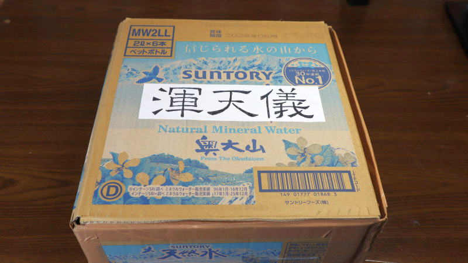　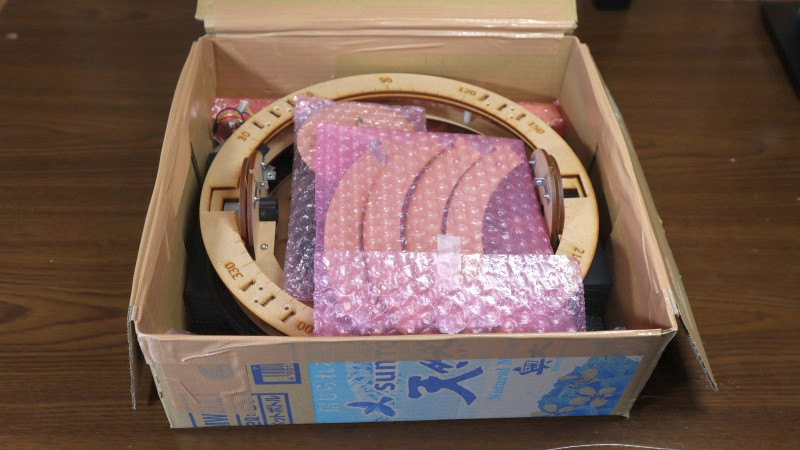

## (1) 台
### (1.1) 底板に支持環を取り付ける (● M3-6mmナベネジ 仮止め)
NE(艮)、SE(巽)、SW(坤)、NW(乾)の順に。
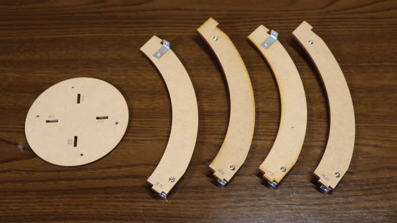　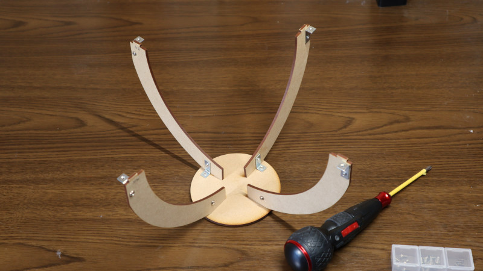

### (1.2) 地平環に支持環を取り付ける (▼ M3-6mm低頭ネジ 仮止め)
NE(艮)、SE(巽)、SW(坤)、NW(乾)の順に。  
その後、(1.1) (1.2) の本締め。
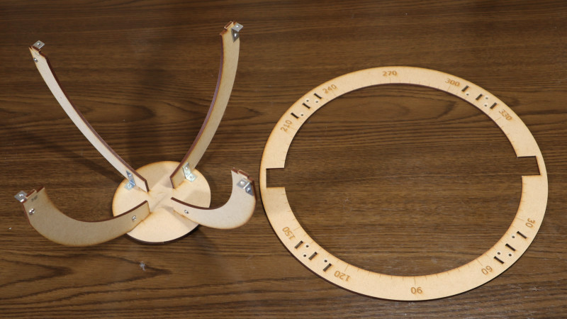　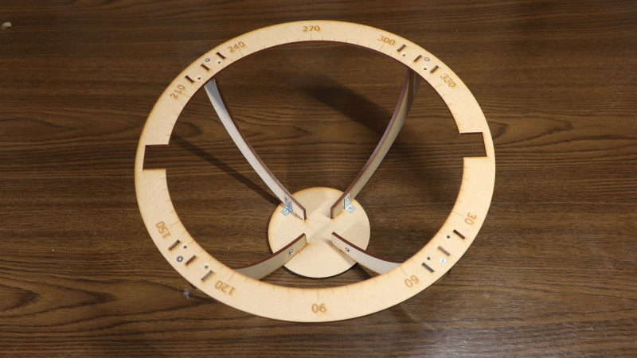

### (1.3) 地平環に脚を取り付ける (▼ M3-6mm低頭ネジ)
NE(艮)、SE(巽)、SW(坤)、NW(乾)の順に。
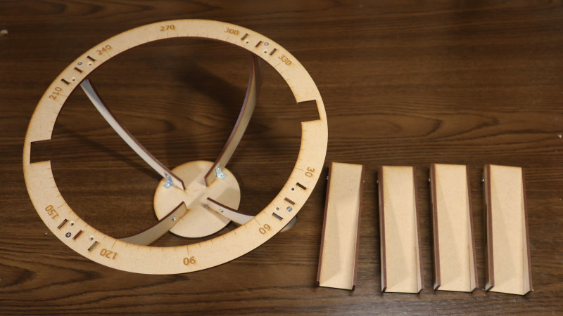　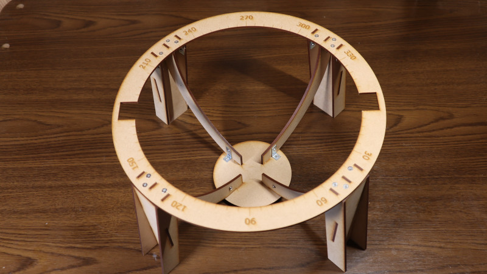

## (2) 天球
### (2.1) 北回帰環・赤道環・南回帰環を18時(冬至)の天経環に取り付ける
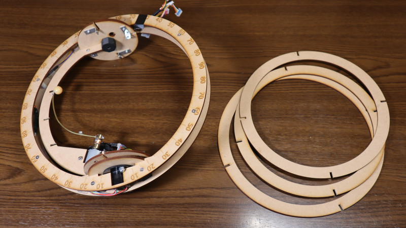　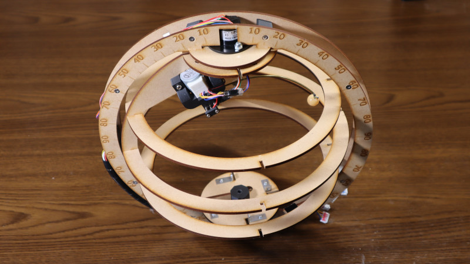

### (2.2) 0時(春分)の天経環を北極環と南極環に取り付ける (● M3-6mmナベネジ 仮止め)
### (2.3) 6時(夏至)の天経環を北極環と南極環に取り付ける (● M3-6mmナベネジ 仮止め)
### (2.4) 12時(秋分)の天経環を北極環と南極環に取り付ける (● M3-6mmナベネジ 仮止め)
その後、(2.2)～(2.4) の本締め。
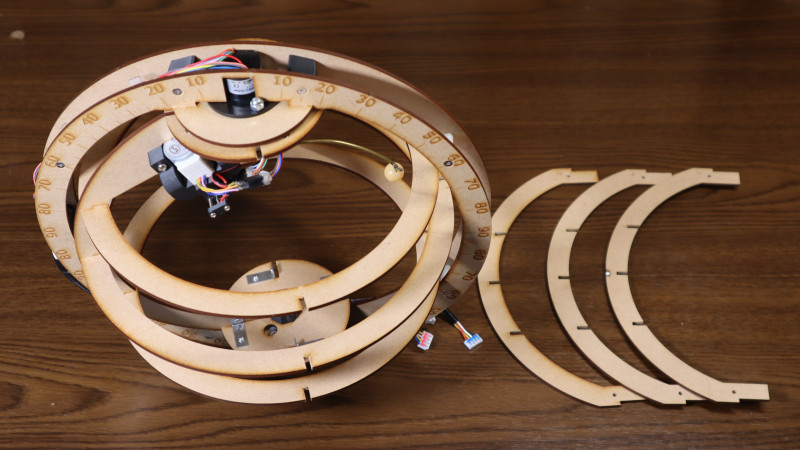　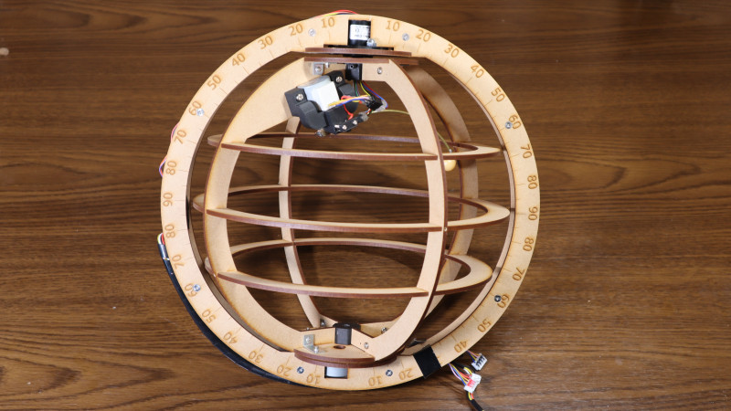

## (3) 黄道環
### (3.1) Pisces(双魚宮)を0時(春分)の天経環に取り付ける (▽ M2-6mm皿ネジ 仮止め)
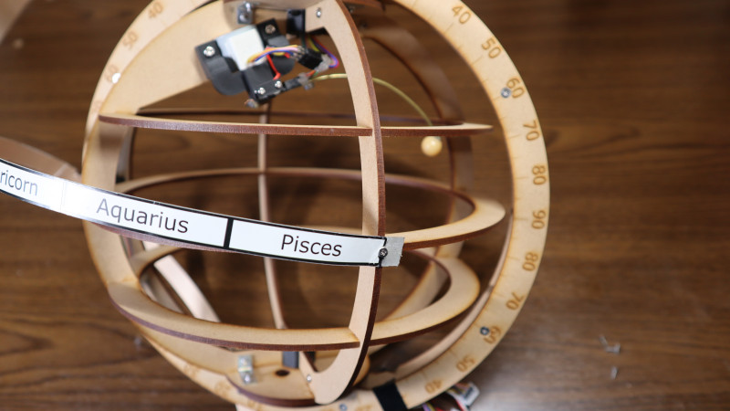

### (3.2) Capricorn(磨羯宮)を18時(冬至)の天経環に取り付ける (▽ M2-6mm皿ネジ)
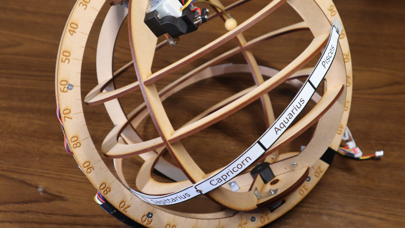

### (3.3) Libra(天秤宮)を12時(秋分)の天経環に取り付ける (▽ M2-6mm皿ネジ)
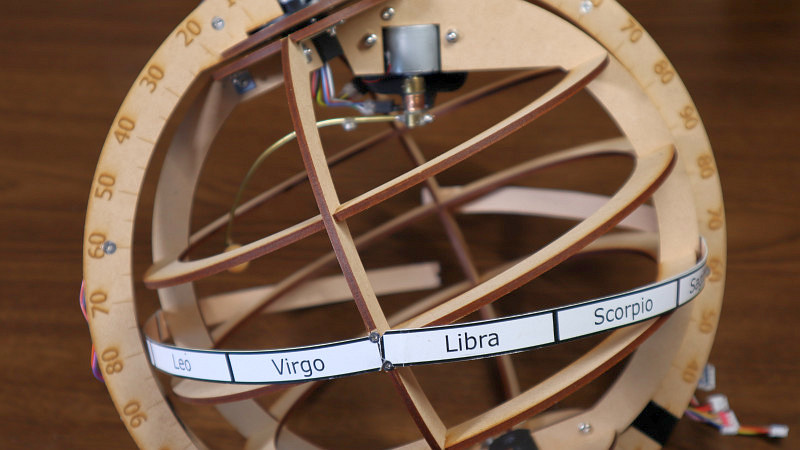

### (3.4) Cancer(巨蟹宮)を6時(夏至)の天経環に取り付ける (▽ M2-6mm皿ネジ)
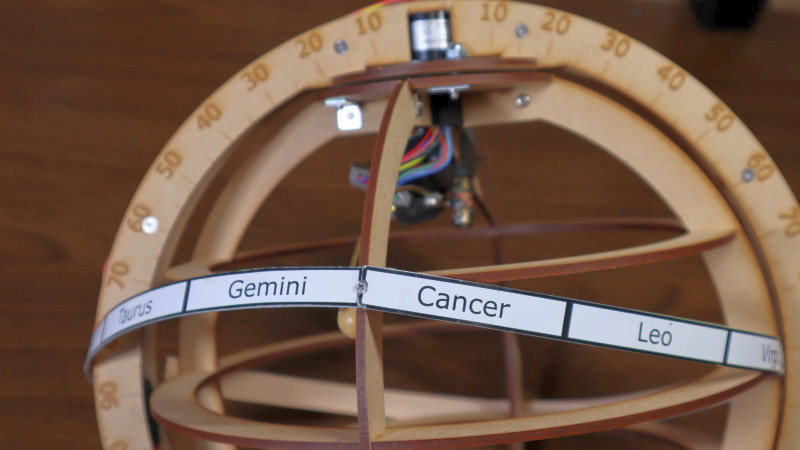

### (3.5) Aries(白羊宮)を0時(春分)の天経環に取り付ける (▽ M2-6mm皿ネジ 本締め)
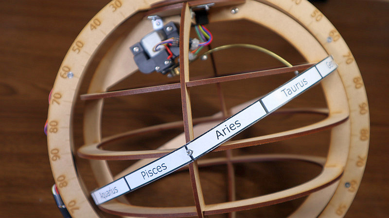

### (4) 天球を台に乗せて完成
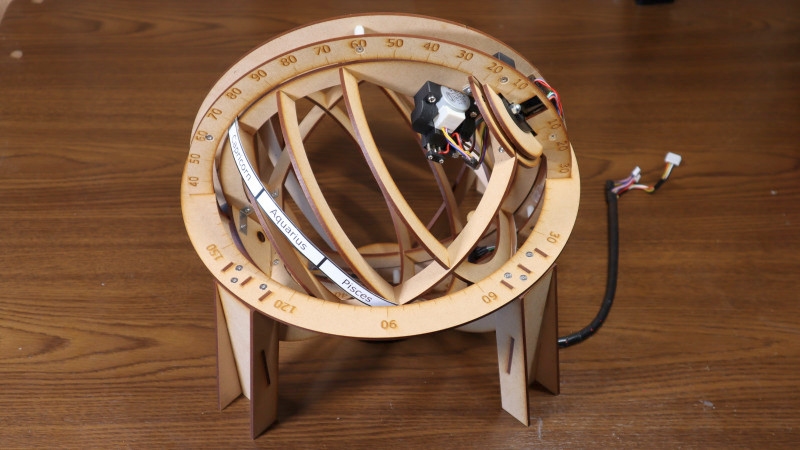

# 解体
基本的には組立ての逆手順である。

## (1) 黄道環
### (1.1) Aries(白羊宮)を0時(春分)の天経環から取り外す (▽ M2-6mm皿ネジ 緩める)
### (1.2) Cancer(巨蟹宮)を6時(夏至)の天経環から取り外す (▽ M2-6mm皿ネジ)
### (1.3) Libra(天秤宮)を12時(秋分)の天経環から取り外す (▽ M2-6mm皿ネジ ×2)
### (1.4) Capricorn(磨羯宮)を18時(冬至)の天経環から取り外す (▽ M2-6mm皿ネジ)
### (1.5) Pisces(双魚宮)を0時(春分)の天経環から取り外す (▽ M2-6mm皿ネジ)

## (2) 天球
### (2.1) 0時(春分)の天経環を、北極環と南極環から取り外す (● M3-6mmナベネジ)
### (2.2) 6時(夏至)の天経環を、北極環と南極環から取り外す (● M3-6mmナベネジ)
### (2.3) 12時(秋分)の天経環を、北極環と南極環から取り外す (● M3-6mmナベネジ)
### (2.4) 北回帰環、赤道環、南回帰環を、18時(冬至)の天経環から取り外す

## (3) 台
### (3.1) 地平環から脚を取り外す (▼ M3-6mm低頭ネジ)
NE(艮)、SE(巽)、SW(坤)、NW(乾)の順に。

### (3.2) 地平環から支持環を取り外す (▼ M3-6mm低頭ネジ)
NE(艮)、SE(巽)、SW(坤)、NW(乾)の順に。

### (3.3) 底板から支持環を取り外す (● M3-6mmナベネジ)
NE(艮)、SE(巽)、SW(坤)、NW(乾)の順に。
 
